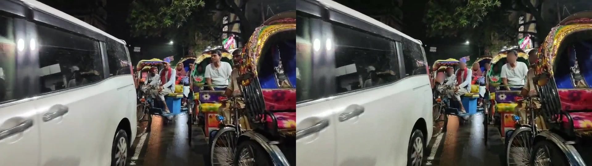
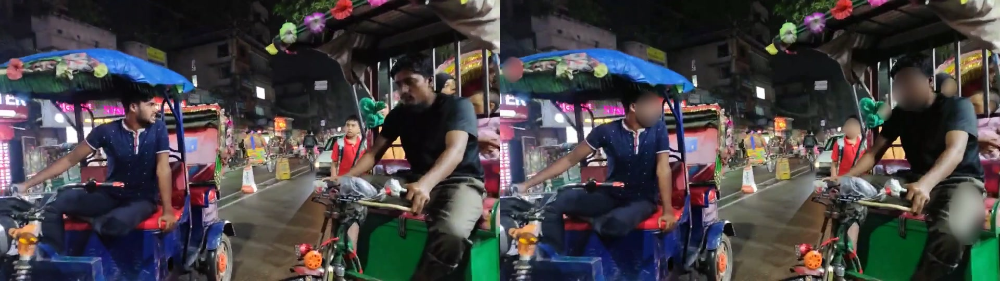
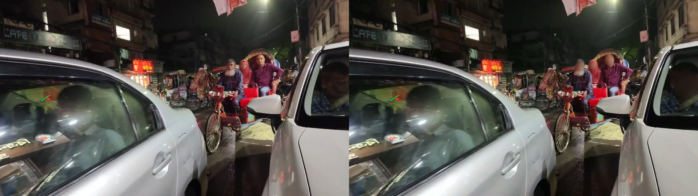
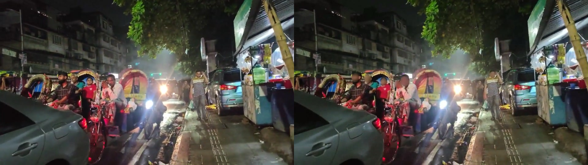
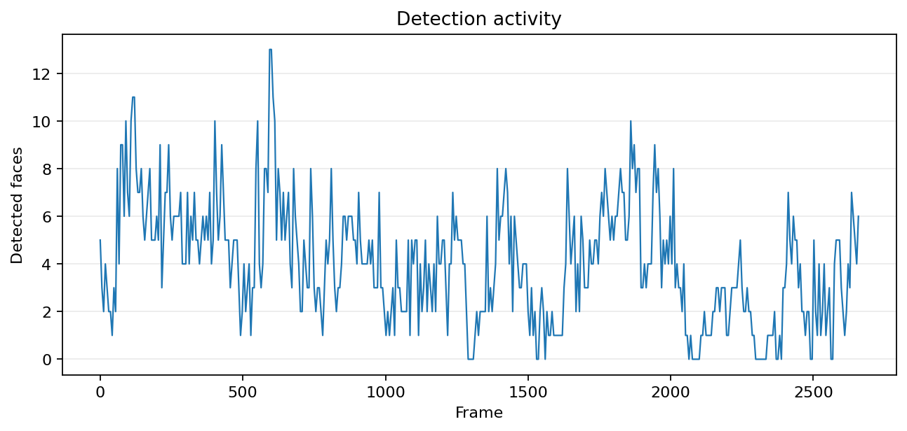
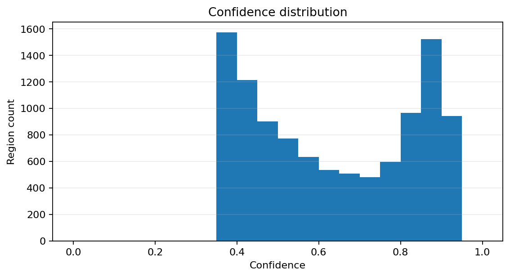

<p align="center">
  
</p>

<h1 align="center">Privacy Processing & Human Verification</h1>

<p align="center">
  AI-assisted video anonymization, Human GT, and quality verification for real-world datasets, supported by customer-specific processing and review rules.
</p>

<p align="center">
  
  
  
  
</p>

<p align="center">
  <a href="https://origindatalab.io"><strong>Visit Website</strong></a>
  ·
  <a href="https://youtu.be/n0HrsoZwtR0"><strong>Watch Demo</strong></a>
  ·
  <a href="reports/v58_technical_report.pdf"><strong>View Technical Report</strong></a>
</p>

> ### Evaluate Our Workflow on Your Own Data
> Send a private 1–5 minute representative sample. We will first review technical feasibility, processing requirements, Human GT or verification scope, security conditions, expected deliverables, schedule, and pilot terms before any larger commitment.
>
> **[Request a Private Sample Evaluation](https://origindatalab.io/contact)** · **[Visit Origin Data Lab](https://origindatalab.io)**
---

## Overview

Origin Data Lab helps AI teams, dataset companies, mobility platforms, and CCTV solution providers prepare privacy-safe, quality-controlled video data for model development, evaluation, and commercial delivery.
Our workflow combines:

- automated face detection and anonymization
- human verification for missed, uncertain, or high-risk cases
- Human GT, annotation correction, and dataset QA
- customer-specific masking, review, and acceptance rules
- delivery in video, image, YOLO, COCO, JSON, JSONL, or CSV formats

This repository presents a public V58 evaluation using dense, low-light urban traffic footage.

> **This public V58 evaluation shows automated face-anonymization output and is not a claim of perfect production coverage. Commercial projects can include an agreed Human GT or verification layer based on the customer's quality target, risk level, and acceptance criteria.**

---

## Who We Support

Our services are designed for teams that need privacy-safe, quality-controlled video data, including:

- ADAS and autonomous-driving teams
- AI dataset and annotation companies
- CCTV and smart-city solution providers
- robotics and mobility companies
- computer-vision research teams
- organizations preparing video data for model training, evaluation, or external delivery

Typical project requirements include:

- face and license-plate anonymization
- Human GT and missed-detection recovery
- customer-specific annotation or masking rules
- video and frame-level quality verification
- structured metadata and format conversion
- difficult footage involving low light, motion blur, occlusion, or dense scenes

---

## Before / After

<p align="center">
  
</p>

### Additional Evaluation Frames

<table>
  <tr>
    <td width="50%" align="center">
      
    </td>
    <td width="50%" align="center">
      
    </td>
  </tr>
  <tr>
    <td width="50%" align="center">
      
    </td>
    <td width="50%" align="center">
      
    </td>
  </tr>
</table>

---

## Demo Video

<p align="center">
 <a href="https://youtu.be/n0HrsoZwtR0">
    
  </a>
</p>

<p align="center">
 <a href="https://youtu.be/n0HrsoZwtR0"><strong>▶ Watch the Public V58 Demonstration</strong></a>
</p>
The demo includes:

- original footage
- automated anonymized output
- side-by-side comparison
- dense urban traffic
- low-light and partially occluded faces

---

## Public Evaluation — V58

| Metric | Result |
|---|---:|
| Video duration | Approximately 1 min 29 sec |
| Processed frames | 2,661 |
| Detected face regions | 10,634 |
| Processing time | 238.3 sec |
| Processing speed | 11.169 FPS |
| Mean detection confidence | 0.637 |
| Evaluation environment | CPU processing |

These values describe this specific public evaluation and should not be interpreted as guaranteed performance for every dataset or environment.

### Detection Summary

<p align="center">
  
</p>

### Confidence Distribution

<p align="center">
  
</p>

---

## Why Companies Start with Origin Data Lab

### Evaluate Quality on Your Own Data

We do not assume that one public benchmark represents every camera, country, lighting condition, or operational environment. A private sample evaluation allows customers to assess the result using their own footage before considering a larger project.

### AI Processing with Defined Human Verification

Automation handles routine detections where conditions allow. Human verification can focus on missed faces, low-confidence regions, temporal inconsistencies, motion blur, occlusion, small targets, and other difficult cases according to the agreed project scope.

### Customer-Specific Delivery Rules

Each project can define its own:

- target objects
- masking strength and rendering method
- Human GT or human-review scope
- acceptance criteria
- output formats
- metadata requirements
- security and deletion conditions

### Direct Pilot Communication

Customers communicate directly with the team responsible for processing and quality review. This reduces handoff delays and allows requirements to be clarified before production scaling.

---

## Human Verification and Human GT

Human verification is applied according to the customer's quality target, security requirements, and agreed review scope.

Review tasks can include:

- missed-face or missed-object recovery
- low-confidence frame inspection
- blur and masking coverage checks
- temporal consistency checks
- bounding-box creation or correction
- annotation creation or correction
- customer-specific exception handling
- final delivery QA

Human-reviewed outputs can be separated from automated outputs and delivered with status information such as:

- automated
- human-reviewed
- human-corrected
- exception or unresolved case

Review capacity, access permissions, QA sampling, and delivery schedules are agreed according to project volume and security requirements.

---

## Request a Private Sample Evaluation

A short private sample allows both sides to confirm technical feasibility, expected quality, security requirements, and delivery scope before a larger commitment.

### 1. Share a 1–5 Minute Sample

Provide a representative sample together with:

- target objects to anonymize, annotate, or verify
- approximate total project volume
- required output format
- desired schedule
- Human GT or verification requirements
- security, retention, or deletion requirements

### 2. Receive a Scope Review

We review the footage conditions, target difficulty, processing requirements, and expected QA scope.

Before processing begins, we confirm:

- pilot deliverables
- processing and verification scope
- expected turnaround
- security and transfer method
- pricing or commercial conditions, where applicable

### 3. Process and Review the Sample

The sample is processed using the agreed automated workflow and, where included, Human GT, human verification, and quality review.

### 4. Receive the Pilot Output

Depending on the agreed scope, delivery may include:

- processed video or image outputs
- QA findings
- detected limitations or edge cases
- metadata or annotation files
- HTML or PDF evaluation report

### 5. Decide Whether to Scale

After reviewing the result, both sides can decide whether to proceed with a larger project and confirm volume, schedule, acceptance criteria, security controls, and pricing.

<p align="center">
  <a href="https://origindatalab.io"><strong>Request a Private Sample Evaluation</strong></a>
</p>

---

## Services

| Service | Scope | Example Outputs |
|---|---|---|
| Face anonymization | Automated privacy masking with optional human verification | MP4, MOV, image sequences |
| Human verification and GT | Missed-detection review, correction, annotation, QA | YOLO, COCO, JSON, JSONL, CSV |
| Dataset preparation | Metadata generation, restructuring, format conversion | Customer-defined schemas |
| Private pilot evaluation | Small-batch quality and workflow validation | Processed sample, HTML/PDF report |

---

## Security and Data Handling

Security and data-handling requirements are reviewed before each private pilot or commercial project.

The project agreement can define:

- approved data-transfer and delivery methods
- project-specific storage locations
- personnel authorized to access the data
- whether human verification is permitted
- retention and deletion schedules
- NDA and confidentiality requirements
- separation of customer project files
- restrictions on model training or secondary use
- customer-specific security documentation

Customer data is not used for external model training or unrelated purposes without written approval.

The exact controls depend on the agreed project scope and available infrastructure. This public repository does not claim certifications or regulatory compliance that have not been formally verified.

---

## Known Limitations

Automated anonymization can be affected by:

- severe motion blur
- extreme low light
- heavy occlusion
- very small or distant faces
- reflections, displays, posters, or face-like objects
- rapid camera movement
- compression artifacts
- unusual camera angles

Automation alone may not fully resolve every situation. Human verification can be included according to the quality target and risk level agreed for the project.

---

## Reports and Public Resources

- [HTML Evaluation Report](reports/v58_public_evaluation.html)
- [Technical Evaluation Report (PDF)](reports/v58_technical_report.pdf)
- [▶ Watch the Public V58 Demo on YouTube](https://youtu.be/n0HrsoZwtR0)
<details>
<summary><strong>Repository structure</strong></summary>

```text
privacy-processing-demo/
├── README.md
├── LICENSE
├── assets/
│   ├── logo/
│   │   └── origindatalab-logo.png
│   ├── charts/
│   │   ├── confidence_chart.png
│   │   └── detection_chart.png
│   ├── images/
│   │   ├── before_after.jpg
│   │   ├── before_after_003s.jpg
│   │   ├── before_after_008s.jpg
│   │   ├── before_after_030s.jpg
│   │   └── before_after_061s.jpg
│   └── thumbnails/
│       └── demo-thumbnail.jpg
├── demo/
│   └── origin_data_lab_face_anonymization_demo_v58.mp4
└── reports/
    ├── v58_public_evaluation.html
    └── v58_technical_report.pdf
```

</details>

---

## About Origin Data Lab

Origin Data Lab provides privacy processing, Human GT, human verification, dataset QA, metadata generation, and custom data-production support for AI and computer-vision projects.

We begin with a small, representative sample rather than asking customers to commit immediately to a large project.

The purpose of the pilot is to verify:

- performance on the customer's own data
- customer-specific processing rules
- Human GT or human-review requirements
- security and data-handling conditions
- expected deliverables, schedule, and cost

Production scaling is discussed only after the customer has reviewed the pilot output.

---

## Discuss a Private Pilot

**Email:** [contact@origindatalab.io](mailto:contact@origindatalab.io?subject=Private%20Pilot%20Inquiry)

**Website:** [https://origindatalab.io](https://origindatalab.io)
To request a private sample evaluation, please include:

- organization and project type
- data type and representative sample duration
- approximate total project volume
- objects to anonymize, annotate, or verify
- expected output format
- required Human GT or verification scope
- desired schedule
- security, access, retention, or deletion requirements

We will first review technical feasibility and project requirements. Pilot scope, deliverables, schedule, security conditions, and pricing will be confirmed before processing begins.
---

<p align="center">
  <strong>Origin Data Lab — Practical AI Processing, Human Verification, and Dataset Quality Support</strong>
</p>
